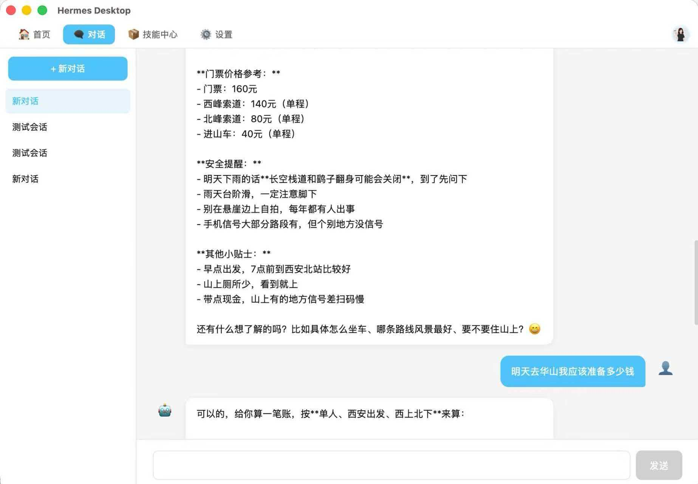
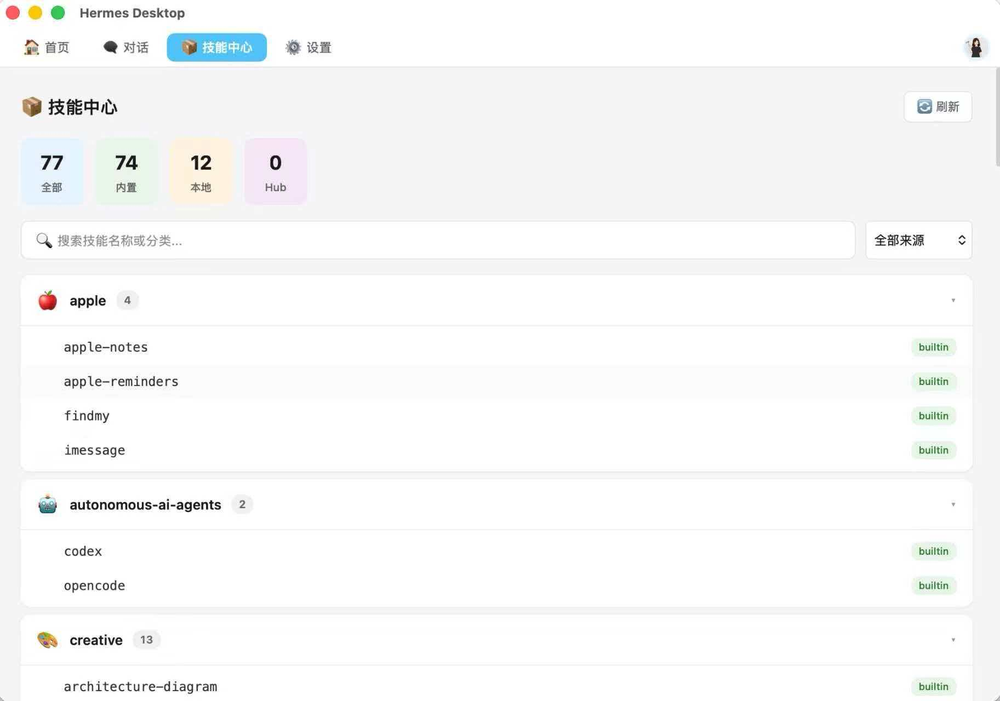
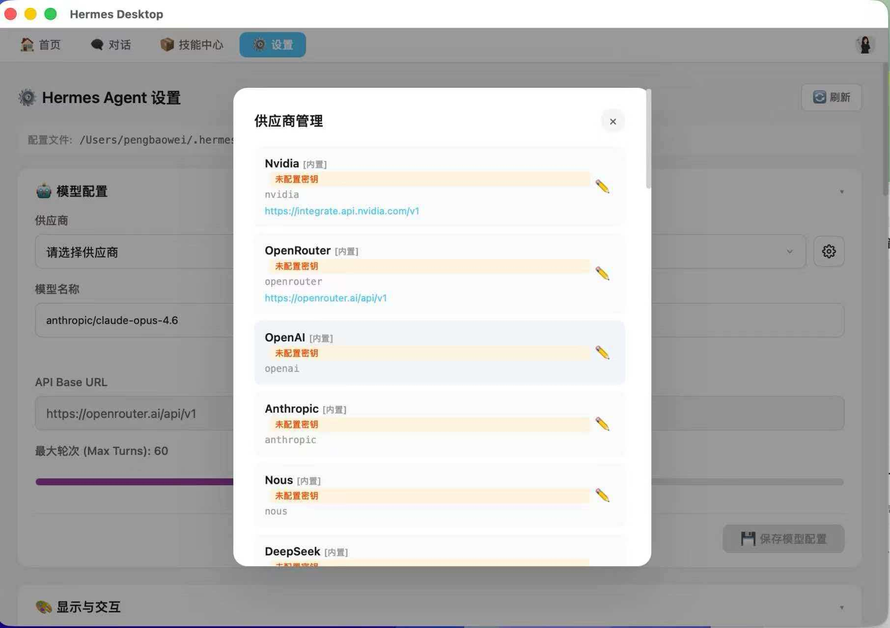
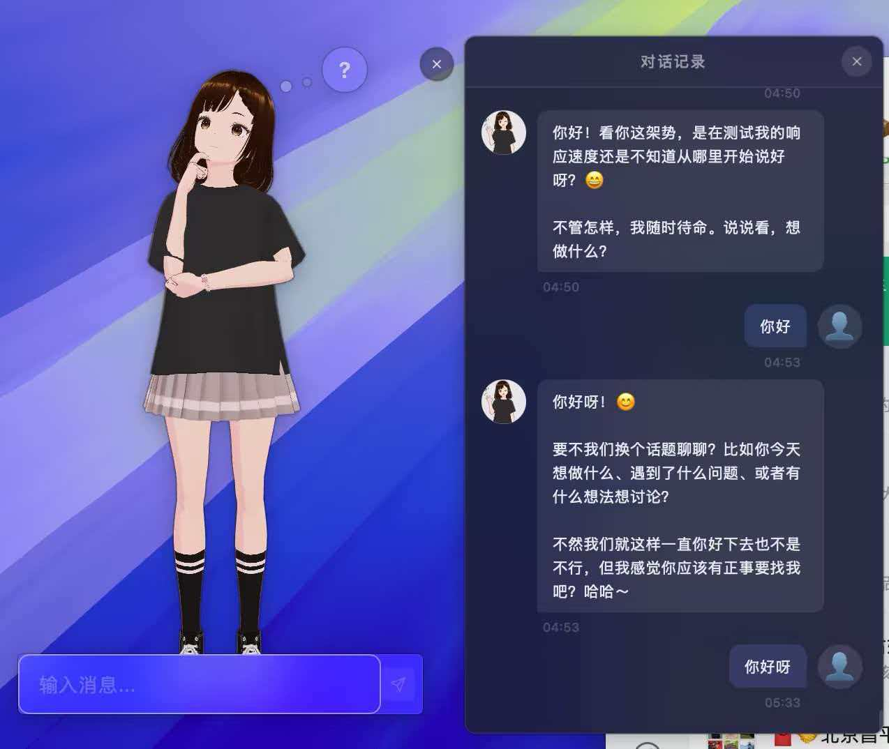

# Hermes Desktop

一款以 **3D VRM 数字人** 为核心的跨平台 AI 助手桌面客户端。

- 默认以**悬浮数字人 Widget** 形态呈现，漂浮在桌面上
- 右键菜单唤起完整功能（首页 / 对话 / 设置 / 技能中心）
- 白色主题，简洁时尚科技感

[English](./README_EN.md) | 简体中文

---

## 🎯 产品定位

Hermes Desktop 不是又一个聊天窗口——它给你的 AI 助理赋予了一个"形象"。

启动后，桌面上只漂浮着一个可爱的数字人"小跃"，跟你打招呼：

> "Hi 主人您好，我是你的助理小跃"

右键点击它，功能菜单出现：**首页、对话、设置、技能中心**。双击则快速进入主界面。

---

## ✨ 核心特性

### 🎭 悬浮数字人
- 启动后默认进入悬浮 Widget 模式，无边框、透明、漂浮桌面
- VRM 3D数字人形象，idle 动画（呼吸/眨眼）
- 打招呼语音："Hi 主人您好，我是你的助理小跃"
- 左键双击 → 打开主界面
- 右键 → 功能菜单
- 可拖动，位置记忆

### 🗨️ 智能对话
- 实时流式响应，打字机效果
- Agent 思考过程可见可追溯
- 多会话管理，历史记录持久化

### ⚙️ 完整配置中心
- 模型配置 / 记忆管理 / 技能中心 / MCP Server / 平台连接 / 安全沙盒

### 🖥️ 跨平台
- ✅ macOS（Apple Silicon + Intel）
- ✅ Windows（x64）

---

## 📷 界面预览

### 首页


### 智能对话


### 技能中心


### 系统设置


### VRM 数字人


### 数字人对话


---

## 🛠️ 技术栈

| 层级 | 技术 |
|------|------|
| 桌面框架 | Tauri 2.x |
| 前端 | React + TypeScript + Tailwind CSS |
| 3D渲染 | Three.js + @pixiv/three-vrm |
| 对话内核 | Hermes Agent |

---

## 📦 快速开始

### 前置依赖

- Node.js ≥ 18
- Rust ≥ 1.70

### 安装运行

```bash
git clone https://github.com/pengbw/hermes-desktop.git
cd hermes-desktop
npm install
npm run tauri dev
```

### 构建

```bash
npm run tauri build
```

产物位于 `src-tauri/target/release/bundle/` 目录下。

---

## 📄 开源协议

Apache License 2.0
