# Hermes Desktop

一款以 **VRM 3D 数字人** 为核心的多模块 AI 桌面客户端，融合智能对话、项目工作室、知识库和技能中心。

- 默认以**悬浮数字人 Widget** 形态呈现，漂浮在桌面上
- 右键菜单唤起完整功能（首页 / 对话 / 工作室 / 知识库 / 技能中心 / 设置）
- 支持**语音输入**和 **TTS 语音回复**
- 白色主题，简洁时尚科技感

[English](./README_EN.md) | 简体中文

---

## 🎯 产品定位

Hermes Desktop 不是又一个聊天窗口——它给你的 AI 助理赋予了一个"形象"，并提供了完整的 AI 工作平台。

启动后，桌面上只漂浮着一个可爱的数字人"小跃"，跟你打招呼：

> "Hi 主人您好，我是你的助理小跃"

右键点击它，功能菜单出现：**首页、对话、工作室、知识库、技能中心、设置**。双击则快速进入主界面。

---

## ✨ 核心特性

### 🎭 悬浮数字人

- 启动后默认进入悬浮 Widget 模式，无边框、透明、漂浮桌面
- VRM 3D 数字人形象，idle 动画（呼吸/眨眼）
- 支持语音输入（Whisper STT）和 TTS 语音回复
- 左键双击 → 打开主界面
- 右键 → 功能菜单
- 可拖动，位置记忆

### 🗨️ 智能对话

- 实时流式响应，打字机效果
- Agent 思考过程可见可追溯
- 多会话管理，历史记录持久化
- 语音输入 + 音频回复播放

### 🏗️ 项目工作室

- **项目管理**：支持多项目，内置六大行业模板（软件开发、内容创作、数据分析、营销策划、游戏开发、学术研究）
- **任务管理**：看板视图、任务分配、优先级管理、进度跟踪
- **角色团队**：每个项目可配置多个 AI 角色，自定义职责和能力
- **工作流引擎**：可视化拖拽设计流程，支持自动推送、需确认、条件分支、并行执行等多种流转模式，内置完整性校验
- **审批面板**：待审批项集中展示，支持通过/驳回/评论
- **产物管理**：自动追踪每个角色的产出物，支持版本对比

### 📚 知识库

- 本地文档索引与检索（RAG），支持 MD/TXT/PDF/DOCX 等主流格式
- ONNX Runtime 本地嵌入，无需联网即可索引
- 文件监听自动更新索引
- 支持知识库与项目/角色绑定

### 🧩 技能中心

- 技能市场浏览，一键安装
- 支持 Hub / 内置 / 本地三种技能来源
- 按分类浏览，支持搜索
- 技能可与角色绑定，定制角色能力

### ⚙️ 完整配置中心

- **模型供应商**：支持 OpenAI / NVIDIA NIM / 本地模型等，灵活配置 API Key、Base URL
- **AI 助手配置**：角色管理、灵魂设定、职责定义、VRM 形象绑定
- **通信渠道**：微信 / QQ / 企业微信 / 钉钉 / 飞书 / Telegram / Discord / Slack / WhatsApp 等
- **动作管理**：VRM 数字人动作编辑、表情管理
- **系统设置**：主题、工作空间、终端后端等

### 🖥️ 跨平台

- ✅ macOS（Apple Silicon）
- ✅ Windows（x86_64）

---

## 📷 界面预览

### 安装引导

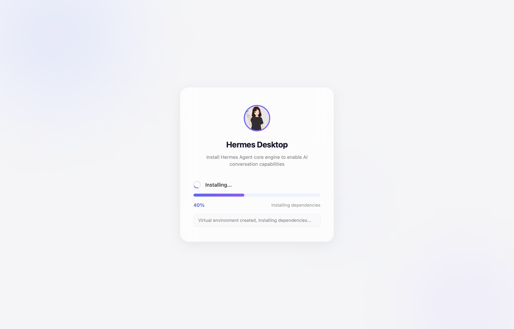

> 📥 安装完成后，进入 **设置 → 供应商管理** 配置 API Key → 选择供应商 → 配置模型 → 保存，即可开始使用。

### 首页

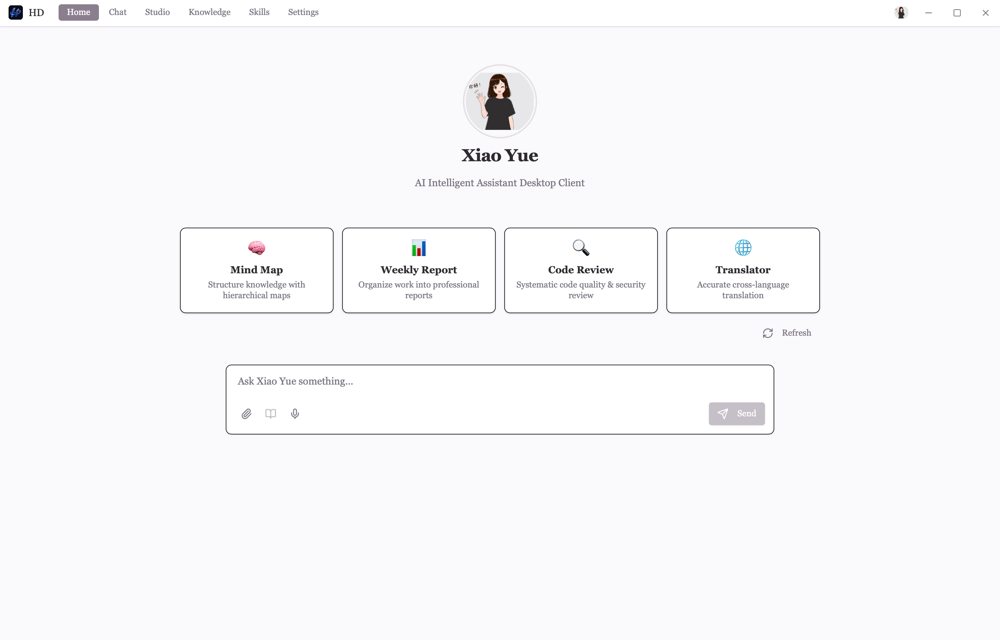

### 智能对话

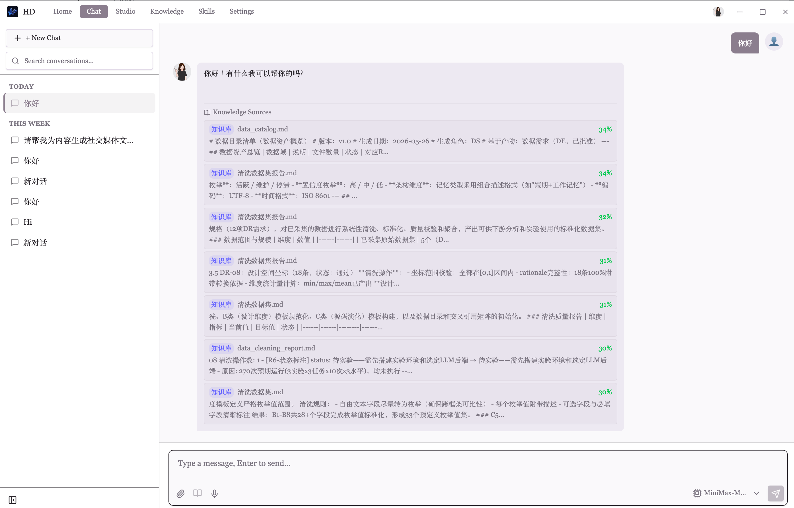

### 技能中心

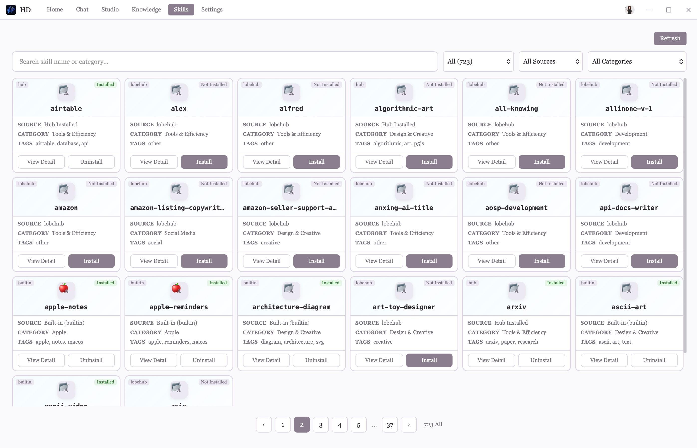

### 系统设置

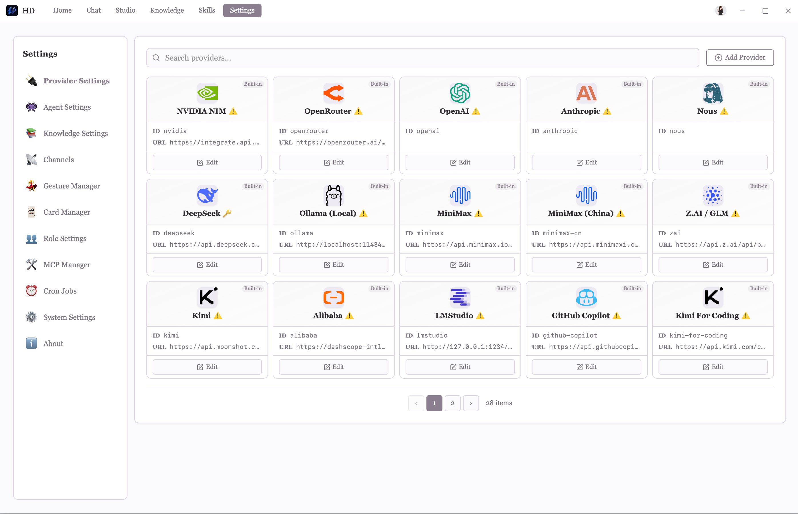

### VRM 数字人


### 数字人对话

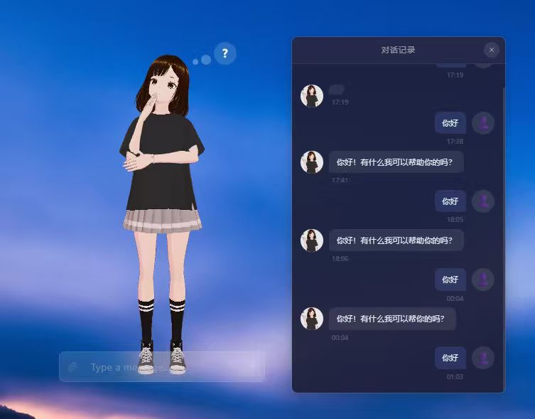

### 动作管理

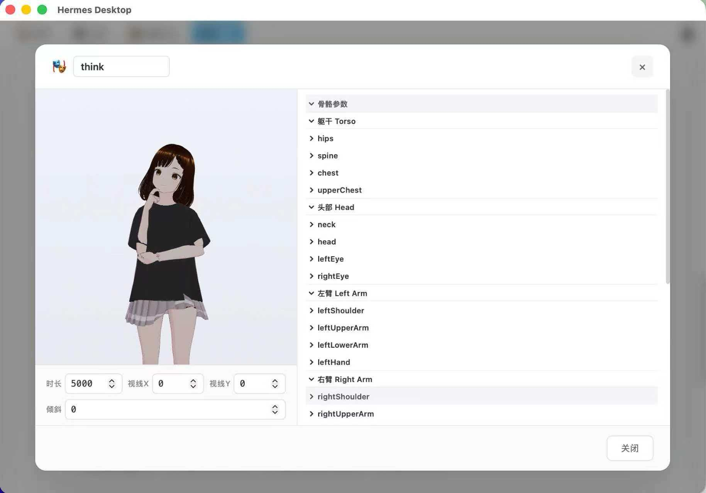

### 🏢 工作室

**项目模板 + 新建项目**

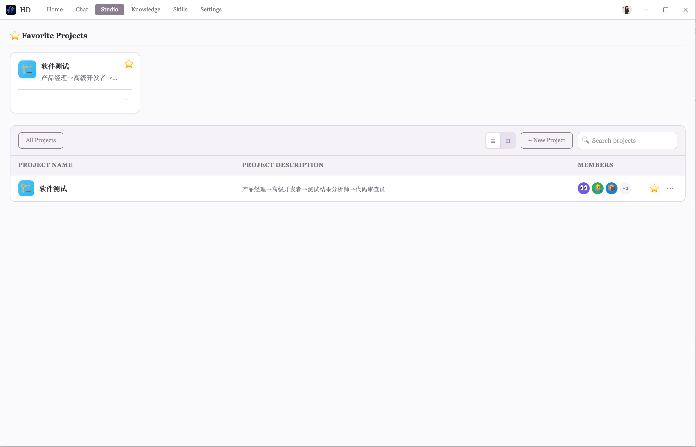

> 选择行业模板（软件开发、内容创作、数据分析等），自动配置角色阵容和工作流，开箱即用。

**工作流设计**

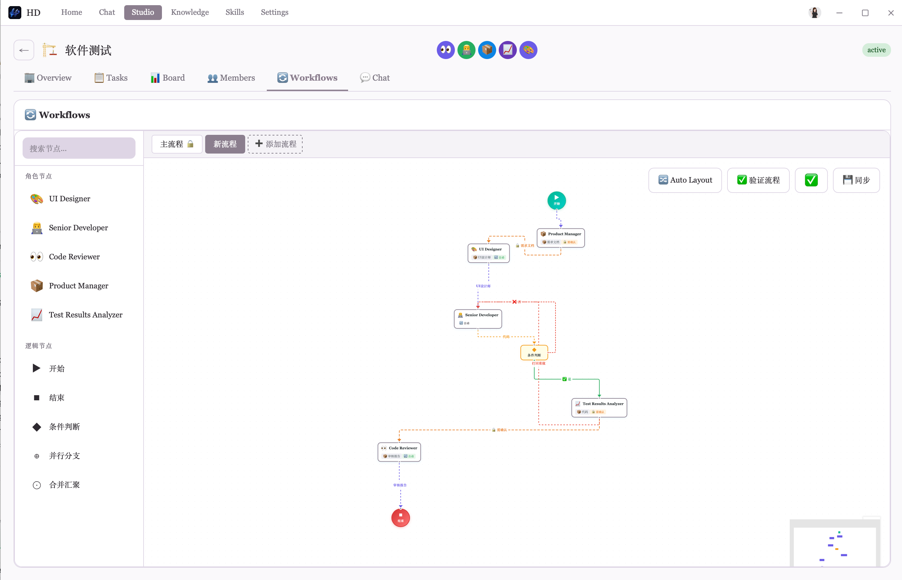

> 可视化编排 AI 角色协作流程：开始 → 节点角色 → 审批门控 → 结束。支持条件分支与并行汇聚。

**多角色协作**


> 内容策划、撰稿人、编辑、审核员实时协同，AI 角色之间自动传递产物，审核意见可追溯。

**角色管理**

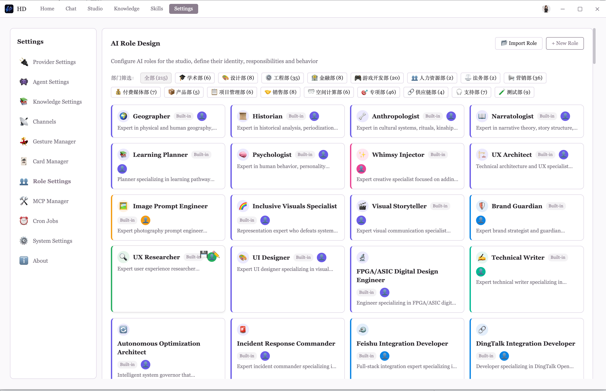

> 每个角色独立配置职责描述、专属技能与工作进度，任务分工一目了然。

**技能市场**


> 721+ 技能插件可选安装，覆盖 AI 代理、设计创意、社交媒体等分类，按需扩展 Agent 能力。

**知识库对话**

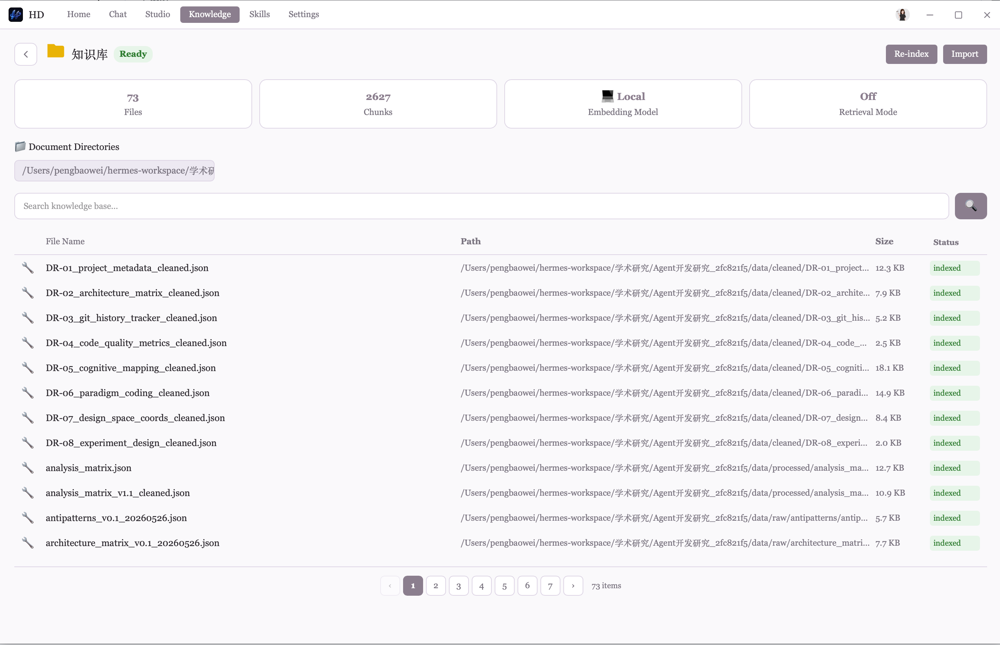

> 基于本地文档的 RAG 对话，检索结果实时展示文档来源与匹配度，来源可溯。

**通信设置**

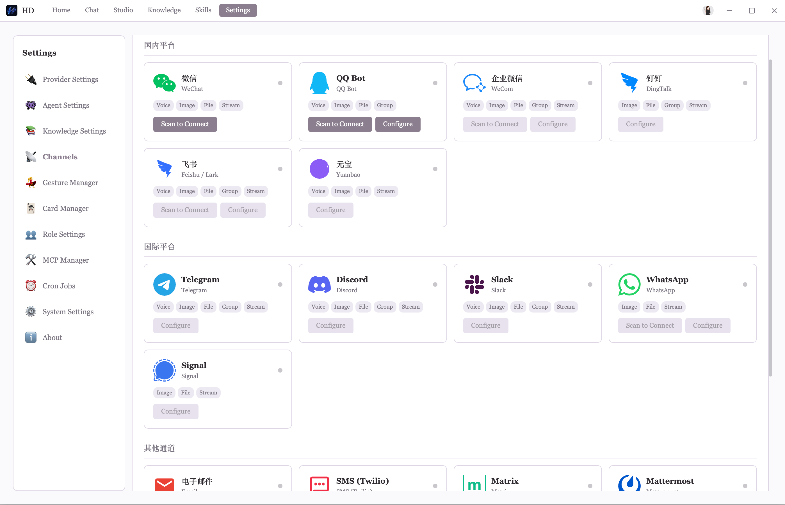

> 一键接入微信、QQ、元宝、钉钉、飞书等平台，消息收发与 AI 回复无缝打通。

**MCP 插件**

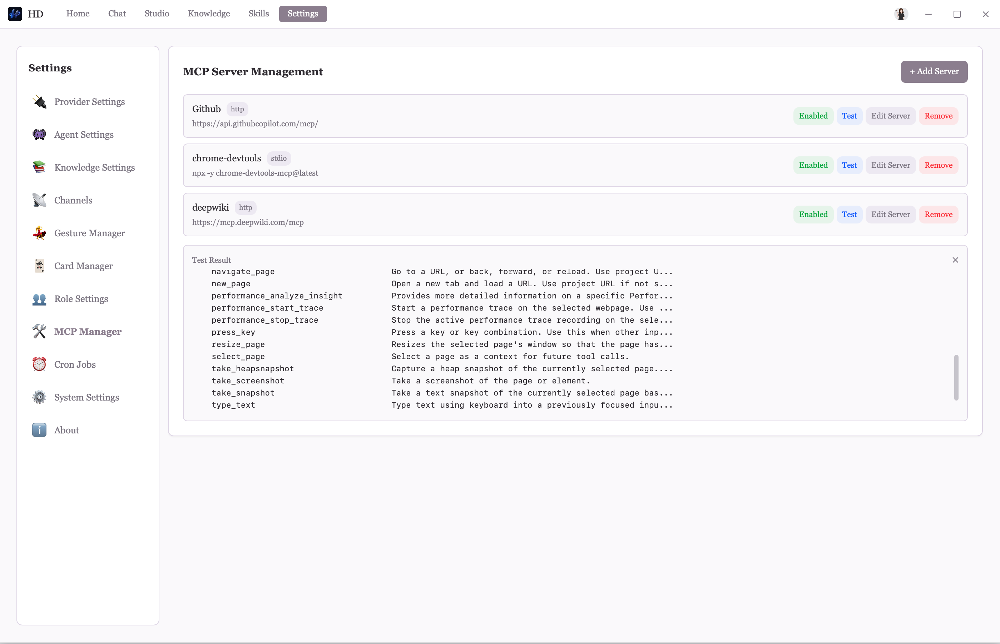

> 添加mcp插件。

**定时任务**

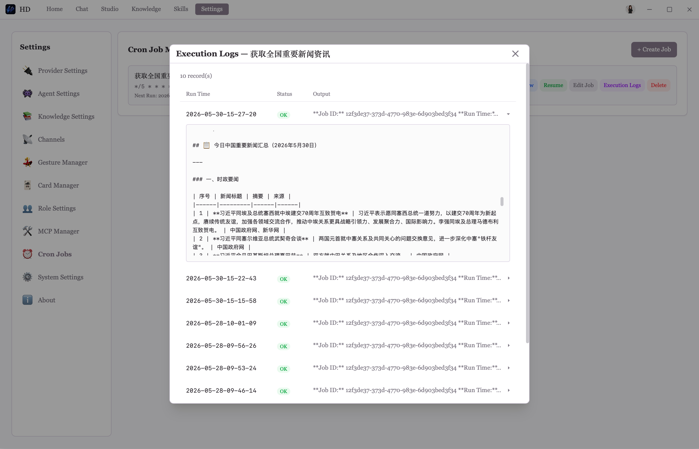

> 配置定时任务，如每日备份、自动关闭等。

---

## 🛠️ 技术栈

| 层级     | 技术                                       |
| -------- | ------------------------------------------ |
| 桌面框架 | Tauri 2.x                                  |
| 前端     | React 19 + TypeScript + CSS Modules + Vite |
| 3D 渲染  | Three.js                                   |
| 状态管理 | Zustand                                    |
| 后端     | Rust + SQLx + SQLite + Tokio               |
| 嵌入模型 | ONNX Runtime / Candle                      |
| 语音识别 | Whisper (Python)                           |
| 语音合成 | edge-tts (Python)                          |
| 工作流   | 自研 Hermes Workflow Engine                |

---

## 📦 快速开始

### 前置依赖

- Node.js ≥ 18
- Rust ≥ 1.70

### 安装运行

```bash
git clone https://github.com/pengbw/hermes-desktop.git
cd hermes-desktop
node ./scripts/download_hermes_source.cjs
npm install
npm run tauri dev
```

### 获取 API Key

> 支持 NVIDIA NIM（免费额度），地址：https://build.nvidia.com/settings/api-keys
>
> 使用邮箱注册后即可获取免费 AI API Key

### 构建

```bash
npm run tauri build
```

产物位于 `src-tauri/target/release/bundle/` 目录下。

---

## ❓ 常见问题

### macOS 提示"已损坏，无法打开"

由于应用未经过 Apple 公证签名，macOS Gatekeeper 会阻止打开并提示"已损坏"。在终端中执行以下命令移除隔离属性即可：

```bash
xattr -cr "/Applications/Hermes Desktop.app"
```

或者前往 **系统设置 > 隐私与安全性**，找到被阻止的应用，点击"仍要打开"。

---

## 💬 交流与反馈

> 如果 Hermes Desktop 对你有帮助，欢迎扫码支持 ☕
>
> 你的鼓励是我们持续开发的最大动力！

|  |  |

> 扫码关注公众号：**小跃行迹**，获取更新通知 & 使用技巧


---

## 📄 开源协议

Apache License 2.0
